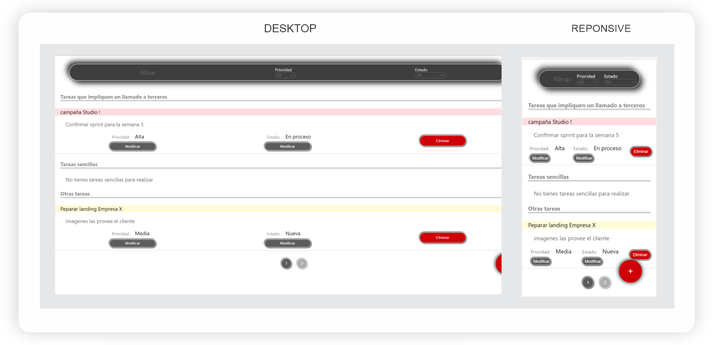

<h1 align="center">
    ToDo App 
</h1>

ToDo App es la clásica api para crear tareas

  

Dentro de las funcionalidades se pueden:

- Crear tareas completando diferentes especificaciones como prioridad, estado, acción y descripción.
- Modificar "prioridad" y "estado" de las tareas
- Filtar tareas de acuerdo a la "prioridad" o "estado"
- Eliminar tareas

Como particularidad se puede asignar la acción a realizar para organizar la vista de acuerdo la complejidad de las acciones:
- requieren un llamado a terceros
- simples 
- Otras: opción seleccionada por defecto si no asigna una acción. 

Toda la interfaz del usuario, con DISEÑO RESPONSIVE, está desarrollada con REACT y CSS puro.

